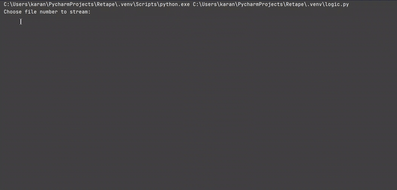

# Voicemail Compliance Engine

A real-time audio decision system that determines **exactly when to drop a compliant voicemail** during outbound calls by analyzing streamed voicemail greetings.

This project simulates **telephony-grade streaming audio** and makes compliance-safe decisions based on **audio content**, not wall-clock timing.

---

## Problem Overview

In outbound calling systems, voicemail greetings vary significantly:

- Some greetings end with a beep  
- Some end with silence  
- Some contain no beep at all  
- Greeting lengths vary widely  

If a prerecorded voicemail message starts:
- **Too early** → Compliance violation  
- **Too late** → Poor customer experience  

The core challenge is to determine, **in real time**, the precise moment when the greeting has ended and it is legally safe to play the voicemail message.

---

## Solution Summary

The Voicemail Compliance Engine listens to streamed audio and makes a deterministic decision using two ordered rules:

1. **Beep Detection (Primary Rule)**  
   Detects the voicemail beep using spectral analysis.  
   When detected, the voicemail message is triggered immediately.

2. **Silence Detection (Fallback Rule)**  
   If no beep exists, sustained post-speech silence is used to infer the end of the greeting.

---

## System Architecture – Flow Diagram

```text
Voicemail Audio Source
----------------------
WAV File / Simulated Call
        |
        v
+----------------------------+
| FastAPI Streaming Server   |
|----------------------------|
| - Streams PCM16 audio      |
| - 20 ms fixed frames       |
| - Telephony-style timing   |
+-------------+--------------+
              |
              v
+----------------------------+
| Frame Buffer & Decoder     |
|----------------------------|
| - Bytes -> PCM frames      |
| - Timestamp frames         |
| - Track audio-time         |
+-------------+--------------+
              |
              v
+----------------------------+
| Compliance Decision Engine |
+----------------------------+
              |
              |
     +--------+--------+
     |                 |
     v                 v
+-----------+    +------------------+
| Beep      |    | Voice Activity   |
| Detector  |    | Detector (VAD)   |
|-----------|    |------------------|
| Spectral  |    | Energy-based     |
| analysis  |    | speech detection |
+-----+-----+    +---------+--------+
      |                    |
      | Beep found         | Speech?
      v                    v
+-------------+     +--------------+
| START VM    |     | Reset silence|
| (Decision)  |     | timer        |
+-------------+     +--------------+
                           |
                           | No speech
                           v
                    +--------------+
                    | Accumulate   |
                    | silence time |
                    +------+-------+
                           |
                           | Silence >= threshold
                           v
                    +--------------+
                    | START VM     |
                    | (Decision)   |
                    +--------------+

Final Output
------------
Compliant Voicemail Playback
- Company name audible
- Callback number audible
- Compliance guaranteed

---
```
## Demo: Step-by-Step (Important)
This demo shows end-to-end streaming detection, exactly as expected in a real phone call.
### Step 1: Choose an audio file to stream
Open server.py and start the stream:
```bash
uvicorn server:app # run this to start streaming
```
The audio stream will be available at:
```python
http://127.0.0.1:8000/audio/stream
```
### Step 3: Run the compliance decision engine
```python
python logic.py
```
choose the file to stream : 1 (for example)

<p align="center">
  
</p>

```python
 [CALL CONNECTED]
 Listening to voicemail...

⏱   10.0s | level=0.1357 | listening...

[COMPLIANCE DECISION]
Reason : Beep detected
Action : Start voicemail at 10.44s
```
### Output
```bash
======================================================================
COMPLIANT VOICEMAIL DROP REPORT (OFFLINE EVALUATION)
======================================================================

File 1: vm1_output.wav
  Start Voicemail At : 10.42 seconds
  Decision Reason   : Beep detected

File 2: vm2_output.wav
  Start Voicemail At : 8.44 seconds
  Decision Reason   : Sustained silence after greeting

File 3: vm3_output.wav
  Start Voicemail At : 8.74 seconds
  Decision Reason   : Sustained silence after greeting

File 4: vm4_output.wav
  Start Voicemail At : 4.62 seconds
  Decision Reason   : Sustained silence after greeting

File 5: vm5_output.wav
  Start Voicemail At : 14.34 seconds
  Decision Reason   : Sustained silence after greeting

File 6: vm6_output.wav
  Start Voicemail At : 3.88 seconds
  Decision Reason   : Sustained silence after greeting

File 7: vm7_output.wav
  Start Voicemail At : 11.78 seconds
  Decision Reason   : Beep detected

======================================================================
END OF REPORT
======================================================================
```
